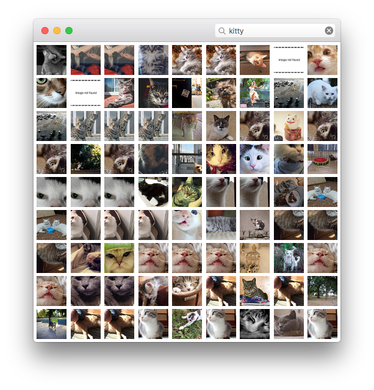

# UXKit Demo

Demo app using Apple's private UXKit framework.

[Learn more](https://medium.com/@guilhermerambo/why-uikit-for-macos-is-important-ff4e74a82cf0#.pg4lysr1t).

Building requires Xcode 8 and a Flickr API Key. Rename `Credentials-Sample.h` to `Credentials.h` and insert your keys.

**I will NOT provide any kind of support for this project, it's just a demo.**

